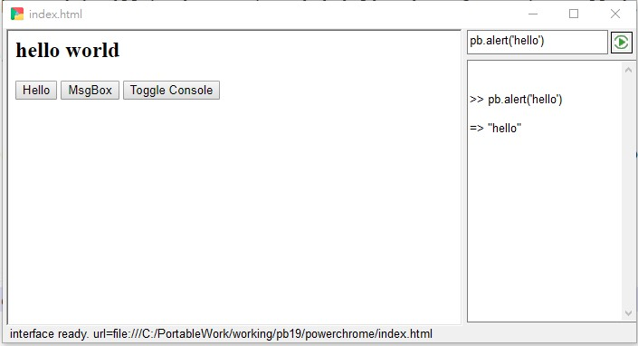

-----------------------------------------------------------------------------
title     : PowerChrome - Getting Started
menu      :    
  GetStarted  : get-started.md
  Interface   : interface.md
  Development : development.md
   : javascript:darkmode()
   : index.md
-----------------------------------------------------------------------------
<style>
  .markdown   { max-width:900px; margin:auto }
  #header     { background: linear-gradient(to bottom right, #06c, #fc0) }
  #left-panel { background: linear-gradient(to bottom right, #eee, #888) }
  h1, h2      { border-bottom:1px solid grey }
  h2, h3, h4  { color:#06c }
</style>

## Introduction

PowerChrome is a powerful and portable web browser that uses the Chromium engine to enable 
fast and easy development of desktop applications using HTML and JavaScript. 

With PowerChrome, you can quickly and easily write and run your own desktop applications, 
providing a seamless user experience for your users.


### Files   {files}

The following files are included in the downloaded package 
[powerchrome-0.60-with-runtime.zip](https://casualwriter.github.io/download/powerchrome-0.60-with-runtime.zip)

File Name       	| Description
--------------------|------------------------
powerchrome.exe 	| PowerChrome program 
powerchrome.js		| JavaScript interface
powerchrome.ini 	| INI config file (optional, recommended for development only)
powerchrome.html	| Default HTML program. it is API quick reference 
powerchrome.pbl 	| Source code of Powerbuilder (2019R3)
sample*.*      	  | Sample files (HTML and MS Access Database)
*.dll           	| Powerbuilder-Runtime Libraries
.\pbcef           | chromium (cef)

PowerChrome is a single execution file (powerchrome.exe), only `powerchrome.exe, powerchrome.js` 
and `Powerbuilder-Runtime` are required. The other files are optional or depends on usage.


### Download and Run

1. Download [powerchrome-0.60-with-runtime.zip](https://casualwriter.github.io/download/powerchrome-0.60-with-runtime.zip) and unzip the all-in-one package.
2. Run `powerchrome.exe`.
3. `powerchrome.html` will be loaded to demonstrate how PowerChrome works with an HTML desktop application.


### Application Startup

PowerChrome load the startup page by the following sequence:

1. commandline options: `/app={startup.html}`
2. ini config at [system] section: `start={startup.html}`
3. index.html 
4. powerchrome.html

after page loaded, `powerchrome.js` will be imported to initialize interface, then call js function `onPageRead()`

To start coding, just simply create ``index.html`` and write your code in any text editor


### Code first application

Let's make a hello world program. Please save below code to "index.html".

```
<h2>hello world</h2>
<button onclick="pb.alert('hello')"> Hello </button>
<button onclick="pb.msgbox('title','hello world')"> MsgBox </button>
<button onclick="pb.api('console')"> Toggle Console </button>
```

and run `pwerchrome.exe` again. 




## PowerChrome Parameters

PowerChrome accepts parameters from `command-line`  -> `powerchrome.ini` -> `JavaScript API`


### Command-line Options    {commandline}

``powerchrome.exe /app={startup.html} /fullscreen /script={interface.js} /save={name.html} /save={name.pdf} /select={selector}``    

* specify application startup page by ``/app={startup.html}`` or ``/url={startup.html}``
* open application in fullscreen ``/fullscreen`` or ``/kiosk``
* use customized interface script by ``/script={interface.js}``
* crawl page by css-selector, and save to HTML file ``/ulr={link} /save={name.html} /css=selector``
* print page to PDF file ``/ulr={link} /save={name.pdf}``


### powerchrome.ini     {ini}

PowerChrome will load initial setting from `powerchrome.ini`. For example

~~~
[System]
start   = {startup-page}
script  = {powerpage.js}
icon    = {icon-name}
watch   = [debug][api][sql][js]
console = {400px}

[browser]
top    = 100
left   = 20
width  = 1024
height = 700

[database]
DBMS=ODBC
DBParm=connectstring='DRIVER={Microsoft Access Driver (*.mdb)};DBQ=sample.mdb'
ServerName = 
LogId   = 
logPass = 
~~~

All setting can be reconfigured by JavaScript API. It is recommended use `powerchrome.ini` in development 
environment, and use JavaScript to configure application in production.


### Encrypt sensitive information  {secret-string}

`Secret-String` is an encrypted string leading with '@'. The string could be used for the following sensitive 
parameter in command-line or `powerchrome.ini`. 

for example, use "secret-string" for startup URL in command line. 

~~~
powerchrome.exe /app=@fmdmnmeqlqdqargpdqmpjtduftkpfppobpmp
powerchrome.exe /app=https://google.com
~~~

for database connection in `powerchrome.ini`

~~~
[database]
DBMS = O90
ServerName = tnsname
LogId  = @secretstring
logPass= @secretstring
DBParm = @secretstring
~~~

to generate [secret string](?file=interface.md#secret), please call out console in PowerChrome, and run 

~~~
pb.api( 'secret', keystring )
pb.api( 'secret', 'https://google.com' )
~~~


### Mini Button     {minibutton}

Up to 6 mini-buttons can be customized in the bottom-right corner. 

Normally, it is setup in the event of `onPageReady()`

~~~
function onPageReady() {

  // clear all mini-buttons
  pb.api( 'minibutton', 'clear' )
  
  // add mini-button of "toggle console panel"
  pb.api( 'minibutton', {script:"console", title:'Console', icon:'tile!'} )
  
  // add mini-button to show about dialog
  pb.api( 'minibutton', {script:'pb.about()', title:'About', icon:'toolkitabout!'} )
  
}  

~~~

The parameter of "script" could be any valid JavaScript, or below predefined action:

* `console`: toggle console panel
* `refresh`: refresh the page. => `location.reload()`
* `back`: go back to previous page. => `history.back()`
* `forward`: go forward. => `history.forward()`
* `about`: popup about-dialog. => `pb.about()` 
* `login`: popup login-dialog. => `pb.login()`


## Connect to Database  {database}

PowerChrome uses native driver to connect major database server (i.e. Oracle, Sybase, MS SQL Server, Informix), 
which is more stable and efficient than JDBC/ODBC/ADO, as long as still can use JDBC/ODBC/ADO/OLE-DB to 
connect all kind of database.

The database driver is provided by following file in `Powerbuilder 2019R3 Run-time`. 

File        | DBMS | Description
------------|------|--------------
pbin9.dll   | IN9  | INFORMIX I-Net 9
pbi10.dll   | I10  | INFORMIX I-Net 10 and 12
pbo90.dll   | O90  | Oracle 9i
pbo10.dll   | O10  | Oracle 10g
pbora.dll   | ORA  | Oracle 11g and later (12c, 18c, and 19c)
pbsnc.dll   | SNC  | SQL Native Client for Microsoft SQL Server
pbmsoledbsql.dll | MSO |  Microsoft OLE DB Driver for SQL Server
pbdir.dll   | DIR  | DirectConnect
pbase.dll   | ASE  | Adaptive Server Enterprise CT-LIB for Adaptive Server 15 only
pbsyc.dll   | SYC  | Adaptive Server Enterprise CT-LIB
pbodb.dll   | ODBC | Microsoft ODBC driver 
pbole.dll   | OLE  | OLE DB interface
pbado.dll, pbrth.dll | ADO | ADO.NET database interface
pbjdb.dll   | JDBC | JDBC database interface

Connection parameters can be defined in the [database] section of `powerchrome.ini`

~~~
[database]
DBMS = ORA
ServerName = {tnsname}
LogId  = {login Id}  
logPass= {login password}
DBParm = {connectstring or DB parameters}
~~~

or connect database by JavaScript `pb.dbConnect(...)` in startup page.

* Syntax: `pb.dbConnect( {dbms}, {dbParm}, {dbServer}, {logId}, {logPass} )`
* return: dbHandle if connected successfully.

### Connect to Oracle

PowerChrome may connect to oracle by native driver, JDBC, OLDDB, ODBC.

* Native O90 `pb.dbConnect( 'O90', '', 'XE', 'scott', 'tiger' )`
* Native ORA `pb.dbConnect( 'ORA', '', 'Oracle19DB', '@jpbpepcqbp', '@lpaqmpmpap' )`
* JDBC `pb.dbConnect( "JDBC", "Driver='oracle.jdbc.driver.OracleDriver',URL='jdbc:oracle:thin:scott/tiger@192.168.1.20:1521/xe'" )`
* OLE DB `pb.dbConnect('OLE', "Provider='OraOLEDB.Oracle'; DataSource='XE'", '.', 'tiger', 'scott')
* OLE DB `pb.dbConnect('OLE', "Provider='MSDAORA'; DataSource='XE'", '.', 'tiger', 'scott')

or defined in `powerchrome.ini` using [secret-string](#secret-string) if necessary.

~~~
[database]
DBMS      = O90
SeverName = XE
LogId     = scott
logPass   = tiger

[database]
DBMS      = ORA
SeverName = Oracle19DB
LogId     = @jpbpepcqbp
logPass   = @lpaqmpmpap

[database-jdbc]
DBMS   = JDBC
dbParm = Driver='oracle.jdbc.driver.OracleDriver',URL='jdbc:oracle:thin:scott/tiger@192.168.1.20:1521/xe'

[database-ole1]
DBMS    = OLE
LogId   = scott
logPass = tiger
dbParm  = Provider='MSDAORA'; DataSource='XE'

[database-ole2]
DBMS    = OLE
LogId   = scott
logPass = tiger
dbParm  = Provider='OraOLEDB.Oracle'; DataSource='XE'

~~~

### Connect to Microsoft SQL Server

### Connect to MySQL database


## Sample application

let's make a markdown editor

### Basic Programming Skeleton

let's start up with a HTML programming skeleton, which consists of the following sections

1. html header
1. css style
1. html layout
1. data section (sql, etc.., optional)
1. script section

~~~
<!DOCTYPE html>
<head>
	<title>PowerChrome Sample</title>
	<meta name="viewport" content="width=device-width, initial-scale=1">
</head>

<!-------------- css style section ------------->
<style>
	body   { line-height:1.5; margin:auto; padding:0; ... }  
	header { background:grey; color:white; height:20px; padding:12px; }
	sql    { display:none }
	div    { font-size:14px; margin:0; padding:0; }
	.....
</style>

<!-------------- html layout -------------------->
<body>
<header>
  <div id="heading" style="float:left;font-size:14px;font-weight:bold">Let's make a markdown editor</div>
  <div id="topmenu" style="float:right">
    <button onclick="app.open()">Open</button>
    <button onclick="app.save()">Save</button>
	....
  </div>  
</header>
<div id="content"> 
....
</div>
</body>

<!------------- SQL or data (optional) ------------>
<sql id="sql-load-list"> ... </sql>
<sql id="sql-save-data"> ... </sql>

<!------------- script section -------------------->
<script>

// when powerchrome page ready, setup mini button and open console 
function onPageReady() {
  pb.api( 'minibutton', 'clear' )
  pb.api( 'minibutton', {script:'refresh', title:'Refresh', icon:'Synchronizer1!'} )
  pb.api( 'minibutton', {script:'pb.about()', title:'About', icon:'toolkitabout!'} )
  pb.api( 'minibutton', {script:"console", title:'Console', icon:'tile!'} )
}  

// prompt message before page close 
function onPageClose() { return 'Close window and exit?' }

// application event/function
const app = { name: "application service" }

app.open = () => { 
   pb.fileOpenDialog()
}

</script>
~~~

### Code Basic Layout by HTML/CSS

Code basic layout by HTML/CSS. As it still a html web page, just simply preview and debug by chrome

### Add functionality

Add program logic by Javascript function Code. before calling `PowerChrome Interface` function, 
it still a normal html page, and simply preview and debug by chrome.

then start code more functionality which required `PowerChrome Interface`.

### Debug in chrome browser

Add the following code to import `powerchrome.js` if `PowerChrome Interface` not found.

~~~
// if run in chrome browser, load interface for debug
window.onload = function() {
  if (typeof webBrowser === "undefined") {
    let scriptEle = document.createElement("script");
    scriptEle.setAttribute("src", "powerchrome.js");
    scriptEle.setAttribute("type", "text/javascript");
    document.body.appendChild(scriptEle);
  } 
}
~~~

Now calling `PowerChrome Interface` in chrome browser will not cause error, it will show API message in console.

### Run within PowerChrome

There is a simple console available in Powerchrome. It can be activated by ini setup.

~~~
[system]
console = 500px
~~~

or activate by javascript `pb.api( 'console', '500px' )`

or activate from mini-button `pb.api( 'minibutton', {script:"console", title:'Console', icon:'tile!'} )`

## Deployment

To execute Powerchrome HTML application, please make sure the following files are available

1. main program `powerchrome.exe` and interface `powerchrome.js`
2. Powerbuilder run-time files in current path or OS search path.
3. your HTML application files.

There are several ways to deploy PowerChrome Application for different purpose.

### Quick deployment (same folder)

The most simple way to deploy PowerChrome Application is put all files in same folder. 

* deploy `powerchrome.exe, powerchrome.js` to client's folder
* deploy `powerbuilder runtime` to same folder
* copy html program to the same folder. e.g. `index.html`, `main.html`

It is **portable**. No need to setup anything but run application. may directly run from local path or USB stick. 

* run application by `powerchrome.exe`, if application main is `index.html`
* run application by `powerchrome.exe /app=main.html`, if application main is `main.html`

### Deploy runtime to another folder

Another recommended way is put run-time files to system search path, and deploy PowerChrome Application to another folder.

* deploy `powerbuilder runtime` to a folder, e.g. `c:\app\pb2019-runtime`
* add the folder to PATH. e.g. `PATH=c:\app\pb2019-runtime;%PATH%`
* deploy `powerchrome.exe, powerchrome.js` and html program to any folder. e.g. `c:\app\crm\`

This setup is suitable for multiple PwerChrome applications in client's PC, which no need to 
copy duplicated run-time to a client's local storage.

### Deploy application to network folder

Deploy PowerChrome program with run-time files to a folder, and deploy HTML application to network share folder.

* deploy `powerchrome.exe, powerchrome.js` to local. e.g. `c:\app\powerchrome`
* deploy `powerbuilder runtime` to same folder 
* deploy html application to network folder. e.g. `\\it-server1\cms\*.html`
* run application by `powerchrome.exe /app=\\it-server1\cms`
* or use secret-string for start url. `powerchrome.exe /app=@npcqeretaqopcpaqkqkpitpompiq`

### Deploy application to web server

Deploy PowerChrome program with run-time files to a folder, and deploy HTML application to 
internal/external web server.

* deploy `powerchrome.exe, powerchrome.js` to client's folder
* deploy `powerbuilder runtime` to same folder
* deploy html application to internal/external web server
* run application by `powerchrome.exe /app=https://web-server:8080/cms`
* or use secret-string for start url. `powerchrome.exe /app=@apipbqamnmklamlqmpkudqnqmojtduftkpfppobpmp`
    
Be aware the security concern if HTML application is deployed to **external web server**.

Highly recommended use `secret-string` for startup url!

* run application by `powerchrome.exe /app=https://app.myserver.com/cms`
* recommented use secret-string. `powerchrome.exe /app=@ppgpfqducqopcqftdpppmlamlmplhpcqjufpcqcqjtduftkpfppobpmp`

### Cloud Mode and Security

PowerChrome will run in **cloud-mode** when the startup link start with `https://` or `https://`. 

In cloud mode, **PowerChrome-JavaScript-Interface** is available for the URL in **SAME DOMAIN**. 

for example, run `chromechrome.exe` for web-application:

```
powerchrome.exe /app=https://app.mycompany.com/crm/index.html
```

API will only available for URL start with ``https://app.mycompany.com/crm/``.

If navigate to another domain, PowerChrome works like **normal chromium browser**.

## More Information

More documentation can be found at https://casualwriter.github.io/powerchrome

* [Document Home](?file=index.md)
* [Getting Started](?file=get-started.md)
* [Interface (API)](?file=interface.md)
* [Development Guide](?file=development.md)


