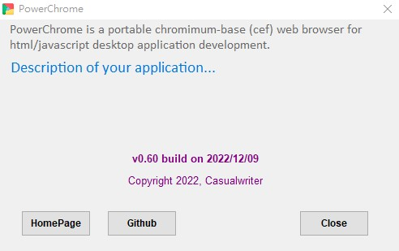
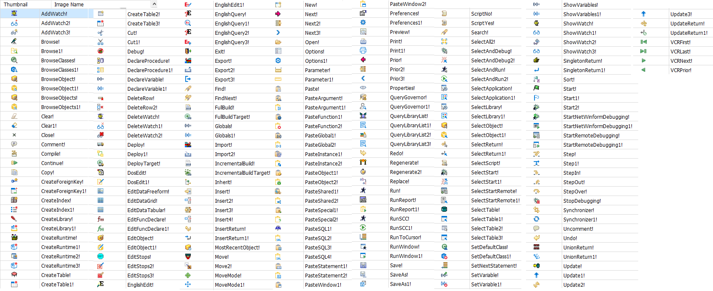

-----------------------------------------------------------------------------
title     : PowerChrome: Interface
menu      :    
  GetStarted  : get-started.md
  Interface   : interface.md
  Development : development.md
   : javascript:darkmode()
   : index.md
-----------------------------------------------------------------------------
<style>
  .markdown   { max-width:960px; margin:auto }
  #header     { background: linear-gradient(to bottom right, #06c, #fc0) }
  #left-panel { background: linear-gradient(to bottom right, #eee, #888) }
  h1, h2      { border-bottom:1px solid grey }
  h2, h3, h4  { color:#06c } 
</style>

## Overview (API)

PowerChrome is written for html/javascript application. Basically it is a chromium-base (cef) web browser with 
interface with Powerbuilder application engine.

The interface provides the following application supports.

* access `windows shell` to run/execute command
* access `file system` 
* access `database`  
* make `http request`
* application property and variables
* application services (e.g. call html-dialog)
* printing, and reporting service

Please note that interface call is running in **Synchronization Modes**. no need to consider `callback` or `promise.js`.


### How it works

PowerChrome will load the startup HTML page with built-in Chromium-based web browser, import the 
`powerchrome.js` file to initialize the interface, and then call `window.onPageReady()` to start the application.

Once the interface has been initialized, the HTML/JavaScript application can call `pb.apiFunctions(..)` to 
access the application's services.
  

### API Syntax

There are three forms for an API call. For example,

* api-function: ``pb.run( 'notepad.exe', 'c:/temp' )``
* api-action: ``pb.api( 'run', {cmd: 'notepad.exe', path: 'c:/temp' } )``
* api-url: ``window.webBrowser.ue_interface( 'run?cmd=notepad.exe&path=c:/temp' )``

Notes:

* `api-function` is the javascript functions created in `powerchrome.js` for specified purpose.
* `api-action` is a js function calling API by action, in the syntax `pb.api( {action}, { parm1:value1, parm2:value2, ...}`.
* `api-function` and `api-action` will transform to `api-url` format and pass to interface
* `api-url` is for internal usage only, not recommended to use directly

This document will cover `api-function` and `api-action` only.

## Events

### window.onPageReady()

After `powerchrome.js` is loaded and interface initialized, event `window.onPageReady()` will be called for page/application startup.

Normally, will setup mini-button, DB connection, application variables in this event for application main page.
for example,

~~~
// when page ready, setup mini button
function onPageReady() {
  
  // setup mini buttons 
  pb.api( 'minibutton', 'clear' )
  pb.api( 'minibutton', {script:'pb.about()', title:'About', icon:'toolkitabout!'} )
  pb.api( 'minibutton', {script:"console", title:'Console', icon:'tile!'} )
  pb.api( 'minibutton', {script:'refresh', title:'Refresh', icon:'Synchronizer1!'} )
  pb.api( 'minibutton', {script:'back', title:'Go Back', icon:'Prior3!'} )
  
  // connect to database
  pb.dbConnect('ODBC',"connectstring='DRIVER={Microsoft Access Driver (*.mdb)};DBQ=sample.mdb'")
  
  // user sign in, close if failed. 
  let userid = pb.login()
  
  if ( userid == '1'  ) {
     pb.close()
  } else {
     pb.session( 'userid',  pb.login() )
  }

  // app. startup...
  
}  

~~~


### window.onPageClose()

When user try to close PowerChrome (i.e. click on [X] or press [Alt-F4]), event `window.onPageClose()` 
will be executed for closing application process.

##### Return

* return `ture` or `yes` to close window
* return `false` or `no` to prevent closing window. 
* return a string {message} to prompt user for confirmation 

##### sample

~~~
// prompt message before page close 
function onPageClose() { 
  return 'Close window and exit?' 
}
~~~
  
  
## Basic Functions

### pb()

equivalent to `document.getElementById( {id} )`, this function is defined by the following code in `powerchrome.js`

~~~
const pb = (id) => { return document.getElementById(id) }
~~~

##### Sample

* `pb('left-panel')` is same as `document.getElementById('left-panel')`
* `html = pb('left-panel').innerHTML` is same as `html = document.getElementById('left-panel').innerHTML`
  

### pb.api()

##### Syntax

* syntax1: `pb.api( {action}, {string} )`
* syntax1: `pb.api( {action}, {parms} )`

##### Parameters

* `{action}` is the API action
* `{string}` is the string parameter. 
* `{parms}` is the object parameter. e.g. `{cmd:'notepad.exe', path:'c:\temp'}`

##### Sample

* run notepad. `pb.api( 'run', 'notepad.exe' )
* run notepad. `pb.api( 'run', { cmd:'notepad.exe', path:'c:\temp'} )`
   
   
## Access window shell
   

### pb.run()    {run}

execute DOS command by `WScript.Shell -> run()`

##### Syntax

* syntax1: ``pb.run( {command} )`` 
* syntax2: ``pb.run( {command}, {path}, {style} )``
* syntax3: ``pb.api( 'run', { cmd:{command}, path:{path}, style: {style} } )``

##### Parameters

* `{command}` window command
* `{path}` the file path to run the command
* `{style}` := [ normal | min | max | hide ] [ +wait ]

##### Return

* for syntax1, returns "1" for success, and "-1" if an error occurs.
* for syntax2/syntax3, return "0"

##### Sample

* run notepad ``pb.run( 'notepad.exe' ) => ``pb.api('run','notepad.exe')``
* run notepad to edit file ``pb.run('notepad.exe powerchrome.html')``
* run notepad (maximized)  ``pb.run('notepad.exe powerchrome.html','','max')``
* run notepad and wait ``pb.run('notepad.exe','','wait')`` 
* run from a path ``pb.run('notepad2.exe', 'c:/temp')``
* call windows "Control Panel".  ``pb.run('control')``
* call windows "Group Policy". ``pb.shell( 'gpedit.msc')``
   

### pb.shell()    {shell}

execute command using window shell. this function will windows library `shell32 -> ShellExecute()`

##### Syntax

* syntax1: ``pb.shell( {file}, {parm}, {path}, {action}, {style} )`` 
* syntax2: ``pb.api( 'shell', { file:{file}, parm:{parm}, path:{path}, action:{action}, style:{style} } )``

##### Parameters

* `{file}` filename in windows searchable path
* `{parm}` parameters
* `{path}` directory of the file
* `{action}` := open | print | runas | edit | explorer | find
* `{style}` :=  normal | min | max | hide 

##### Return

* return a string from `shell32 -> ShellExecute()`, details may refer to [microsoft document](https://learn.microsoft.com/en-us/windows/win32/api/shellapi/nf-shellapi-shellexecutea)
* If the function succeeds, it returns a value greater than 32. 
* If the function fails, it returns an error value that indicates the cause of the failure. 

##### Samples

* open folder in file-explorer ``pb.shell('c:/temp')``
* open a file (same as click on the file in file explorer). ``pb.shell('powerchrome.html')``
* print file. ``pb.api( 'shell', { aciton:'print', file:'c:/temp/output.pdf' } )``
   

### pb.sendkeys()   {sendkeys}

send keystrokes by `WScript.Shell -> SendKeys()` with the following enhancement.

1. execute DOS command (e.g. may activate an external program)
2. go to window program for specified title, so that to send keystrokes to this program.
3. delay for seconds, or milliseconds
4. execute JavaScript. (e.g. use JavaScript to show hints dialog) 

##### Syntax

* syntax1: ``pb.sendkeys( {keystrokes} )`` 
* syntax2: ``pb.api( 'sendkeys', {keystrokes} )``

##### Parameters

{keystrokes} support the following special commands with keystrokes, separated by delimiter "/"

* {keystrokes} := `[/run={command}] [/title={title}] [/s={seconds}] [/ms={ms}] [/js={JavaScript}
* `/run={command}` run dos command, e.g. call notepad.exe
* `/title={title}` go to window program for specified title text
* `/s={seconds}` delay for seconds
* `/ms={ms}` delay for milliseconds
* `/js={JavaScript}` run JavaScript

##### Return

return string "1"

##### Samples

* run notepad. ``pb.sendkeys('run=notepad.exe/title=Untitled - Notepad/s=1/hello!\n/ms=800/Have a nice day!')``
* run javascript with keystrokes. ``pb.sendkeys('run=notepad.exe/s=2/Hello/js=alert("hello world")')``
   

## HTML Dialog

### pb.popup(url)    {popup}

popup HTML dialog for multiple usages.

* open a HTML dialog
* crawl a web page
* print a web page
* save a web page to HTML or PDF
* inject JavaScript

##### Syntax

* syntax1: ``pb.popup( {url}, {left:{left}, top:{top}, width:{width}, height:{height}, script:{script}, import:{jsFile} } )`` 
* syntax2: ``pb.api( 'popup', { url:{url}, {left:{left}, top:{top}, width:{width}, height:{height}, script:{script}, import:{jsFile}  } )``

* syntax3: ``pb.popup( {url}, { save:{file}, select:{selector}, mode:{mode} )``
* syntax4: ``pb.api( 'popup', { url:{url}, save:{file}, select:{selector}, mode:{mode} )``

##### Parameters

* `{width}, {height}` assign the width/height of popup window
* `{left}, {top}` assign left/top position of popup window. center the window if no specified.
* `{file}` is the output filename. (filename.html for html format, or filename.pdf for PDF output)
* `{mode} := min | max | hide`, "min/hide" mode may useful for save/crawling web-page.
* `{select} := css-selector` for crawling web page. return string if no output file specified.
* `{script} := JavaScript` to execute JavaScript after page loaded.
* `{import} := jsFile` to import js library after page loaded.

##### Return

* return file name if output to html/pdf file
* return string in html format for crawling web-page
* return string by `pb.close( {return-string} )` for popup html dialog

##### Samples

* open url in html dialog ``pb.popup('https://news.ycombinator.com/')``
* popup dialog in specified width/height ``pb.popup('https://html5test.com/', {width:1024, height:700} )``
* popup dialog in specified position ``pb.popup('https://html5test.com/', {left:200, top:300, width:400, height:200})``
* load web page, and save to file ``pb.popup( 'https://html5test.com/', {save:'html5test.html', select:'table'} )``
* load web page, and save to PDF ``pb.popup( 'https://html5test.com/', {save:'./html5test.pdf', mode:'min'} )``
* crawl selected html for url  ``pb.popup( 'https://news.ycombinator.com/front', {select:'table'} )``
* execute JavaScript after page loaded ``pb.popup( 'sample-dialog.html', {script:"pb.alert('welcome')"} )``
* import JS library after page loaded ``pb.popup( 'sample-dialog.html', {import:"sample-dialog.js"} )``
  

### pb.popup(html)

popup HTML dialog, render page by specified HTML string.

##### Syntax

* syntax1: ``pb.popup( html, {left:{left}, top:{top}, width:{width}, height:{height}, script:{script}, import:{jsFile}  } )`` 
* syntax2: ``pb.api( 'popup', { url:{html}, left:{left}, top:{top}, width:{width}, height:{height}, script:{script}, import:{jsFile}  } )``

##### Parameters

* `{html}` is the string to render page in HTML format.
* `{width}, {height}` assign the width/height of popup window
* `{left}, {top}` assign left/top position of popup window. center the window if no specified.
* `{script} := JavaScript` to inject JavaScript after page loaded.
* `{import} := jsFile` to import js library after page loaded.

##### Return

* return string by `pb.close( {return-string} )`

##### Samples

* render page of hello-world ``pb.popup( '<h2>Hello World!</h2>', { width:300, height:200 } )``
* render page by html string ``pb.popup( pb('sub-page').innerHTML, { width:500, height:300 } )``
  

### pb.close()    {close}

close current window/dialog, with string return.

##### Syntax

* syntax1: ``pb.close()``
* syntax2: ``pb.close( {return-string} )`` 
* syntax3: ``pb.api( 'close', {return-string} )``

##### Return

return specified string

##### Samples

* close and return input value  ``pb.close( pb('user_name').value )`` 
* close with options  ``pb.close( 'yes' )``, ``pb.close( 'no' )``  
   

## Http Request   {http}
   
### pb.httpSource()    {httpsource}

get the source of specified link, for multiple purpose

1. get html source for html page
2. get json result for web-service (cross-domain is ok)
3. get result in other format

##### Syntax

* syntax1: ``pb.httpSource( {url} )`` 
* syntax2: ``pb.api( 'http-source', {url} )``

##### Parameters

* `{url}` is the link to get HTML source.

##### Return

a string of the url source (html format, or JSON format, or other format)

##### Samples

* get source of url  ``html = pb.httpSource('https://casualwriter.github.io')``
* get json data ``rs = pb.httpSource('https://hacker-news.firebaseio.com/v0/item/2921983.json')``
  

### pb.httpRequest()    {httprequest}

Send http-request. 

##### Syntax

* syntax1: ``pb.httpRequest( {method}, {url}, {data}, {contentType} )`` 
* syntax2: ``pb.api( 'http-request', { method: {method}, url: {url}, content: {contentType}, data: {data} } )``

##### Parameters

* `{method}` := GET | POST | PUT | DELETE 
* `{url}` is the link to send request.
* `{data}` is the parameter for POST/PUT action
* `{contentType}` assign the content type in request header

##### Return

a string in json format. e.g. `{ "status":200, "code": 1 "result":"....." }`

##### Samples

* send http Request ``rs = pb.httpRequest('GET','https://www.google.com/search?q=html')``
* send POST request. ``rs = pb.httpRequest('GET','https://localhost:8080/myWebService.jsp', {id:"1024"} )``
  

## Work with database   {db}

### pb.dbConnect()

connect to database transaction. Please refer to [Get-Started - database](?file=get-started.md#database)

##### Syntax

* syntax1: ``pb.dbConnect( {DBMS}, {dbParm}, {ServerName}, {logID}, {logPass} )`` 
* syntax2: ``pb.api( 'db-connect', { dbms:{DBMS}, dbparm: {dbParm}, servername: {ServerName}, logid: {logID}, logpass: {logPass} )``

##### Parameters

* `{DBMS}` := ORA | O90 | O10 | ODBC | JDBC | ADO | OLE | ...
* `{dbParm}` is the additional parameters for DB drivers
* `{ServerName}` is the database server name
* `{LogID}` is the login user id for database server
* `{logPass}` is the login password for database server

##### Return

* if connect success, return `{ "status":0, "sqlerrtext":"", "dbHandle":106262036 }`
* if connect failed, return `{ "status":-1, "sqlerrtext":"error message", "dbHandle":0 }`

##### Samples

~~~
// connect to Oracle (native O90) 
let rtn = JSON.parse( pb.dbConnect( 'O90', '', 'XE', 'scott', 'tiger' ) )

if (rtn.status < 0 ) {
  pb.alert( 'Error! Cannot connect to database\nMessage:' + rtn.sqlerrtext )
  return
}
~~~

~~~
// connect to Oracle (native for 11g - 19c) 
pb.dbConnect( 'ORA', '', 'Oracle19DB', '@jpbpepcqbp', '@lpaqmpmpap' )

// connect to Oracle via JDBC 
pb.dbConnect( "JDBC", "Driver='oracle.jdbc.driver.OracleDriver',URL='jdbc:oracle:thin:scott/tiger@192.168.1.20:1521/xe'" )

// connect to Oracle via OLEDB (OraOLEDB.Oracle)
pb.dbConnect('OLE', "Provider='OraOLEDB.Oracle'; DataSource='XE'", '.', 'tiger', 'scott')

// connect to Oracle via OLEDB (MSDAORA) 
pb.dbConnect('OLE', "Provider='MSDAORA'; DataSource='XE'", '.', 'tiger', 'scott')

// connect to MS Access via ODBC 
pb.dbConnect( "ODBC", "connectstring='DRIVER={Microsoft Access Driver (*.mdb)};DBQ=sample.mdb'" )
~~~
  
### pb.dbCommit()

commit database transaction. 
  
### pb.dbRollback()

rollback database transaction. 
  
### pb.dbQuery()

execute SQL query and return string in json format.

##### Syntax

* syntax1: ``pb.dbQuery( {sql} )`` 
* syntax2: ``pb.api( 'db-query', { sql:{sql} } )``

##### Parameters

* `{sql}` is the SQL query script

##### Return

~~~
// if query success, return json string like 
{ "colCount":4 , "rowCount":8 , 
    "colLabels": [ "col-label-1", "col-label-2", "col-label-3", etc... ], 
    "columns":  [ "col-name-1", "col-name-2", "col-name-3", etc.. ] , 
    "data": [ { "col-name-1": row0-val1 , "col-name-2": row0-val2, ""col-name-3": row0-val3, etc..}, 
              { "col-name-1": row1-val1 , "col-name-2": row1-val2, ""col-name-3": row1-val3, etc..}, 
              etc...
            ] 
}

// if query failed, return json string like below
`{ "status":-2, "error": "cannot find table categories...\n\nselect * from categories" }
~~~

##### Samples

* run query, return json string.  ``pb.dbQuery("select * from categories")``
* run query, get json.  ``rs = JSON.parse(pb.dbQuery('select * from categories'))``
  

### pb.dbTable()

execute SQL query and return string in HTML table format.

##### Syntax

* syntax1: ``pb.dbTable( {sql} )`` 
* syntax2: ``pb.api( 'db-table', { sql:{sql} } )``

##### Parameters

* `{sql}` is the SQL query script

##### Return

return a html table like below 

~~~
<table class=\"pb-table\">
<tr><th>Categoryid</th> <th>Categoryname</th> <th>Description</th> <th>Remarks</th> </tr>
<tr><td>1</td><td>Beverages</td><td>Soft drinks, coffees, teas</td><td>&nbsp;</td></tr>
<tr><td>2</td><td>Condiments</td><td>Sweet and savory sauces</td><td>&nbsp;</td></tr>
<tr><td>3</td><td>Confections</td><td>Desserts, candies, and sweet breads</td><td>&nbsp;</td></tr>
</table>
~~~

##### Samples

* run SQL query, return html table.  ``pb.dbTable('select * from categories')``
* run SQL query, return html table.  ``pb.dbTable('SELECT * FROM NLS_DATABASE_PARAMETERS')``
  

### pb.dbExecute()

execute SQL statement.

##### Syntax

##### Syntax

* syntax1: ``pb.dbExecute( {sql} )`` 
* syntax2: ``pb.api( 'db-execute', { sql:{sql} } )``

##### Parameters

* `{sql}` is the executable SQL script

##### Return 

* if success, return json string `{ "status": 1, "sqlcode":0, "sqlerrtext":"null" }`
* if error, return json string `{ "status": -1, "sqlcode":-1, "sqlerrtext":"error message..." }

##### Samples

* Update Record. ``pb.dbExecute("update categories set remarks='testing..' where CategoryName='PowerChrome'")``
* Insert Record. ``pb.dbExecute("insert into categories values (99, 'PowerChrome', 'Test Record', '')")``
* Delete Record. ``pb.dbExecute("delete from categories where CategoryName like 'PowerChrome%'")``
  

## Access file system    {file}
   
   
### pb.fileExists()

check file existence, return a string of "true/false"

##### Syntax

* syntax1: ``pb.fileExists( {file} )``
* syntax2: ``pb.api( 'file-exists', {file} )``

##### Parameters

* {file} is the file name or full path

##### Return

return string `"true"` if file exists, `"false"` if not exists

##### Samples

* check file existence. ``pb.fileExists('sample.txt')``
* check file existence. ``pb.api( 'file-exists', 'sample.txt')``
  
  
### pb.fileRead()

read a text file. return file content in string.

##### Syntax

* syntax1: ``pb.fileRead( {file} )``
* syntax2: ``pb.api( 'file-read', {file} )``

##### Parameters

* {file} is the file name or full path

##### Return

return file content in string. return empty string if file not found

##### Samples

* read ini file ``pb.fileRead('powerchrome.ini')``
* read js file ``pb.api( 'file-read', 'powerchrome.js')``
  

### pb.fileAppend()

append to a file in text format. if file not exists, create the file then append text

##### Syntax

* syntax1: ``pb.fileAppend( {file}, {text} )``
* syntax2: ``pb.api( 'file-append', { file: {file}, text: {text} } )``

##### Parameters

* {file} is the file name or full path
* {text} is the text to append

##### Return

return the count of characters appended.

##### Samples

* Append text to file. ``pb.fileAppend('sample.html', '<h3>hello world!</h3>\n')``
* Append text to file. ``pb.api( 'file-append', {file:'sample.html', text:'this is a test message\n'} )``
  

### pb.fileWrite()

write to a file in text format. overwrite if file exists, create new file if file not exists.

##### Syntax

* syntax1: ``pb.fileWrite( {file}, {text} )``
* syntax2: ``pb.api( 'file-write', { file: {file}, text: {text} } )``

##### Parameters

* {file} is the file name or full path
* {text} is the text to write

##### Return

return the count of characters written.

##### Samples

* Write text. ``pb.fileAppend('sample.html', '<h3>hello world!</h3>\n')``
* Write text. ``pb.api( 'file-write', { file:'sample.html', text:'<h3>hello world!</h3>\n' } )``
  
  
### pb.fileCopy()

Copies one file to another.

##### Syntax

* syntax1: ``pb.fileCopy( {source}, {target} )``
* syntax2: ``pb.api( 'file-copy', { source: {source}, target: {target} } )``

##### Parameters

* {source} is the source file name (or full path）
* {target} is the destination to copy file

##### Return

* "1" for Success
* "-1" for error opening source file
* "-2" for error writing target file

##### Samples

* Copy file. ``pb.fileCopy( 'sample.txt', 'sample1.txt' )``
* Copy file. ``pb.api( 'file-copy', {source:'sample1.txt', target:'sample2.txt'} )``
  
  
### pb.fileMove()

move a file

##### Syntax

* syntax1: ``pb.fileMove( {source}, {target} )``
* syntax2: ``pb.api( 'file-move', { source: {source}, target: {target} } )``

##### Parameters

* {source} is the source file name (or full path）
* {target} is the destination to copy file

##### Return

* "1" for Success
* "-1" for error opening source file
* "-2" for error writing target file

##### Samples

* Move file. ``pb.fileMove( 'sample.txt', 'sample2.txt' )``
* Move file. ``pb.api( 'file-move', { source:'sample1.txt', target:'sample.txt' } )``
  

### pb.fileDelete()

delete a file.

##### Syntax

* syntax1: ``pb.fileDelete( {file} )``
* syntax2: ``pb.api( 'file-delete', {file} )``

##### Parameters

* {file} is the file name or full path

##### Return

return string `"true"` if file exists, `"false"` if not exists

##### Samples

* delete file. ``pb.fileDelete('sample1.txt')``
* delete file. ``pb.api( 'file-delete', 'sample2.txt' )``
  

### pb.dir()    {dir}

get current directory.

##### Syntax

* syntax1: ``pb.dir()``  
* syntax2: ``pb.api( 'dir-current' )``  

##### Return

return the path of current directory
  

### pb.dirExists()

check directory existence, return a string of "true/false"

##### Syntax

* syntax1: ``pb.dirExists( {directory} )``
* syntax2: ``pb.api( 'dir-exists', {directory} )``

##### Parameters

* {directory} is the path of directory

##### Return

return string `"true"` if directory exists, `"false"` if not exists

##### Samples

* check directory existence. ``pb.fileExists('c:\\temp')``
* check directory existence. ``pb.api( 'dir-exists', 'c:/temp')``
  
  
### pb.dirChange()

change directory

##### Syntax

* syntax1: ``pb.dirExists( {directory} )``
* syntax2: ``pb.api( 'dir-change', {directory} )``

##### Parameters

* {directory} is the path of directory

##### Samples

* change the parent folder ``pb.dirChange( '..' )``
* change to app start folder  ``pb.dirChange( pb.property('app.path') )``
* change to temp folder ``pb.api( 'dir-change', 'c:/temp' )``
  
  
### pb.dirCreate()

create a directory

##### Syntax

* syntax1: ``pb.dirCreate( {directory} )``
* syntax2: ``pb.api( 'dir-create', {directory} )``

##### Parameters

* {directory} is the path of directory

##### Samples

* create directory ``pb.dirCreate('tempfolder')``
* create directory ``pb.api( 'dir-create', 'tempfolder' )``
  

### pb.dirDelete()

delete a directory

##### Syntax

* syntax1: ``pb.dirDelete( {directory} )``
* syntax2: ``pb.api( 'dir-delete', {directory} )``

##### Parameters

* {directory} is the path of directory

##### Samples

* delete directory ``pb.dirDelete('tempfolder')``
* delete directory ``pb.api( 'dir-delete', 'tempfolder' )``
   
   
### pb.dirSelect()

select a directory

##### Syntax

* syntax1: ``pb.dirSelect( {message} )
* syntax2: ``pb.api( 'dir-select', {message} )``

##### Parameters

* {message} is the prompt messgae for selec dialog

##### Samples

* select a directory ``myFolder = pb.dirSelect('please select a folder')``
* select a directory ``myFolder = pb.api( 'dir-select', 'please select a folder')``
   
 

## Console and Message
  
  
### pb.console()

show message in console panel. `console.log()` will be diverted to this function to show message.

##### Syntax

* syntax1: ``pb.console( {args} )``
* syntax2: ``console.log( {args} )``

##### Parameters

{args} is the text/objects to show in console.

##### Return

string of the message showing in console

##### Samples

* show message. ``pb.console( 'hello world!' )``
* show multiple values. ``pb.console( 'hello', 3+4, {status:1, msg:"done"} )``
* use console.log. ``console.log( 'hello', 3+4, {status:1, msg:"done"} )``
  
  
### pb.status()

display message in status bar.

##### Syntax

``pb.status( {text} )``

##### Return

return {text}

##### Samples

* prompt message in status-bar ``pb.status('ready')``
* prompt message in status-bar ``pb.status('file sample.ini not found!')``
  

### pb.alert()

display alert message box. this function call MessageBox() instead of `javascript:alert()`

##### Syntax

``pb.alert( {text} )``

##### Parameters

{text} is the text message for alert box

##### Return

return {text}

##### Samples

* show message ``pb.status('Data has been saved')``
* alert for problem ``pb.status('file sample.ini not found!')``
  
  
### pb.msgbox()

display a message box with options 

##### Syntax

``pb.msgbox( {title}, {message}, {options} )``

##### Parameters

* {title} is the title of message box
* {message} is the message of the dialog box
* {options} := ok | yes,no | yes,no,cancel | ok,cancel | retry,cancel | abort,retry,cancel
* {options} := ok | yn | ync | oc | rc | arc  (in short form)

##### Return

return "1"/"2"/"3" depends of selection

##### Samples

* show message with title. ``pb.msgbox( 'ABC system', 'Data has been saved!' )``
* with Yes/No options. ``pb.msgbox( '', 'Save data?', 'yes,no' )``
* with ok/cancel options ``if ( pb.msgbox( 'System', 'Close and exit?', 'ok,cancel' ) == 1 ) pb.close();``
  
  
### pb.error()

display error message in console panel.

this function is defined in `powerchrome.js` by the following code. It will show to console only.

```
pb.error = (code,msg) => { return window.webBrowser.ue_message('console?[error='+code+'] '+msg) }
```

This function is used to standardize error handling. It can be redefined/customized with logging or other 
handling in application.

##### Syntax

``pb.error( {code}, {message} )``

##### Parameters

* {code} is the error code
* {message} is the error message 
  
    
## Application / Misc
   
   
### pb.property()

get or set application properties

##### Syntax

* get property value: ``pb.property( {name} )``
* set property value: ``pb.property( {name}, {value} )``

##### Property Name

Property name shall be one of the following values. 
Please noted that some of them are read-only/get-only (i.e. marked with *).

Name  | Description
------|--------------------------------
popupwindow | `true` to allow popup window by `window.open()`, `false` to disable
contextmenu | `true` to enable popup content menu, `false` to disable
app.title   | application title.
app.version | version information. e.g. `v0.60 build on 2022/12/09`
app.about   | description about the application, which will show in about-dialog.
app.credit  | credit or copyright info. which will show in about-dialog.
app.github  | link to github (for about-dialog)
app.home    | link to product home (for about-dialog)
app.watch   | options for showing debug message, a combination of `[debug] [sql] [api]`
app.icon    | application icon. [builtin-icons](#icons) can be used for this property.
app.cmdline* | (read-only) command line options
app.runtime* | (read-only) path of powerbuilder runtime
app.screenheight* | (read-only) screen height
app.screenwidth* | (read-only) screen width
app.hostname* | (read-only) host name, i.e. computer name
app.path* | (read-only) current path when application starts
app.mode* | (read-only) application mode. i.e. `local` or `cloud`
app.domain* | (read-only) application domain for cloud mode. e.g `https://casualwriter.github.io/app/`
env.{name}* | (read-only) get environment variables. e.g. `PATH`, `JAVA_HOME`, `CLASSPATH`

##### Return

the value of application property

##### Samples

* get the setting of JAVA_HOME. ``pb.property( 'env.JAVA_HOME' )``
* get the setting of CLASSPATH. ``pb.property( 'env.CLASSPATH' )``
* set application title. ``pb.property( 'app.title', 'ABC Inventory System' )``
* set product home. ``pb.property( 'app.home', 'https://abc-inventory.com' )``
* show watch options for debug. ``pb.property( 'app.watch', '[debug][api]' )``
* disable contextmenu. ``pb.property( 'contextmenu', 'false' )``
   
   
### pb.session()    {session}

get or set session variables
   
   
### pb.print()      {print}

show print dialog. similar to `javascript:window.print()`
   
   
### pb.printSetup()

show printer setup dialog to setup printer
   
   
### pb.saveas()     {saveas}

save current page to HTML file or PDF file

##### Syntax

* syntax1: ``pb.saveas( {filename} )``
* syntax2: ``pb.api( 'saveas', {filename} )``

##### Parameters

* save as PDF file if file name end with `.pdf`
* otherwise, save as html file.

##### Samples

* save curent page as PDF. ``pb.saveas('c:/temp/output.pdf')``
* save curent page in HTML format. ``pb.saveas('c:/temp/output.html')``
  
  
## Work with Powerbuilder
   
      
### pb.about()      {about}

show about dialog. The dialog includes application information, and the link to `product home` or `github`



##### Syntax

* syntax1: ``pb.about()``
* syntax2: ``pb.window( 'w_about' )``
   
   
### pb.window()     {window}

call powerbuilder window entry.

##### Syntax

* syntax1: ``pb.window( {winName}, {parm} )``
* syntax2: ``pb.api( 'window', {winName} )``
* syntax3: ``pb.api( 'window', { name:{winName}, parm:{parm} )``

##### Parameters

Currently, the following builtin windows can be called by {winName}.

Window Name | Description
------------|----------------------
w_about     | about dialog
w_login     | login by windows account
w_power_dialog | PowerChrome dialog. similar to `pb.popup(url)`
w_power_kiosk | PowerChrome kiosk. 

##### Samples

* open w_about dialog.  ``pb.window('w_about')`` => ``pb.api('window','w_about')``
* login by windows account  ``pb.window('w_login')`` => ``pb.api('window','w_login')``
   
   
### pb.extfunc()    {extfunc}

Call powerbuilder user-defined functions. 

This function shall use with `powerbuilder-extent-library` in business version.

##### Syntax

* syntax1  ``pb.extfunc( {funcName}, {parm} )``
* syntax2: ``pb.api( 'extfunc', { name:{funcName}, parm: {parm} } )``

##### Samples

* call day-end process.  ``pb.extFunc('f_dayend_process')``
* call user-defined function.  ``pb.extFunc( 'f_my_business', cus_no )``
   

### pb.datawindow() - in development  {datawindow}

make use of powerbuilder datawindow for multiple purposes.

1. display datawindow as report, preview and print out.
2. use datawindow to print special labels
3. use datawindow for data input

##### Syntax

* syntax1  ``pb.datawindow( {dwSyntax}, {style}, {parm} )``
* syntax2  ``pb.api( 'datawindow', { syntax: {dwSyntax}, parm:{parm}, style:{style} } )``

##### Parameters

* {dwSyntax} is the datawindow syntax, exported from Powerbuilder IDE (old version is ok)
* {parm} is the parameter passed to datawindow for data retrieval.
* {style} := retrieve | preview | print | print-silent | form | label | no-print
  
  
## Browser Setup    {browser}

### pb.api('position')

maximize window, or set window position

##### Syntax

* maximized window. ``pb.api( 'position', 'max' )``
* set window position. ``pb.api( 'position', { top:{top}, left:{left}, width:{width}, height:{height} } )``

##### Samples

* maximized window. ``pb.api( 'position' ,'max' )``
* set width/height ``pb.api( 'position', { width:1024, height:700 } )
* set position ``pb.api( 'position', {top:200, left:80, width:1024, height:700} )

### pb.api('console')

show/hide console panel, or set console width.

##### Syntax

* show/hide console. ``pb.api( 'console', {status} )
* set console width. ``pb.api( 'console', {width} )``

##### Samples

* toggle console panel. ``pb.api( 'console' )``
* show console. ``pb.api( 'console', 'show' )``
* hide console. ``pb.api( 'console', 'hide' )``
* set console width. ``pb.api( 'console', '500px' )``

### pb.api('minibutton')

Up to 6 mini-buttons can be customized in the bottom-right corner. 

##### Syntax

* clear all mini-buttons. ``pb.api( 'minibutton', 'clear' )``
* add mini-button. ``pb.api( 'minibutton', {script:{jsScript}, title:{title}, icon:{icon} } )``

The parameter of "script" could be any valid JavaScript, or below predefined action:

* `console`: toggle console panel
* `refresh`: refresh the page. => `location.reload()`
* `back`: go back to previous page. => `history.back()`
* `forward`: go forward. => `history.forward()`
* `about`: popup about-dialog. => `pb.about()` 
* `login`: popup login-dialog. => `pb.login()`

##### Samples

Normally, it is setup in the event of `onPageReady()`

~~~
function onPageReady() {

  // clear all mini-buttons
  pb.api( 'minibutton', 'clear' )
  
  // add mini-button of "toggle console panel"
  pb.api( 'minibutton', {script:"console", title:'Console', icon:'tile!'} )
  
  // add mini-button to show about dialog
  pb.api( 'minibutton', {script:'pb.about()', title:'About', icon:'toolkitabout!'} )
  
}  
~~~

### Builtin Icons   {icons}

##### Application Icons

The following builtin images can be used for application icon by

``pb.property( 'app.icon', {iconName} )``, e.g. ``pb.property( 'app.icon', 'applicationicon2!' )``


##### Mini-button Icons

The following builtin images can be used as mini-button icon.

``pb.api( 'minibutton', {script:"console", title:'Console', icon:'tile!'} )``



Click here to [expand this image](pb2019-icon-action.png), or [full list of builtin icons](pb2019-icon-full.png)


### pb.api('secret')   {secret}

generate `secret-string` for the following system parameters. 

* startup url from command line `/app={secret-string}` or powerchrome.ini
* db connection parameter. i.e. `dbParm, ServerName, logId, logPass`

##### Syntax

may run from console panel by `pb.api( 'secret', {keyword} )`

##### Samples

* encrypt db login user id. ``pb.api( 'secret', 'scott' )``
* encrypt db login password. ``pb.api( 'secret', 'tiger' )``
* encrypt startup url. ``pb.api( 'secret', 'https://192.168.1.36/powerchome/index.html' )``


## More Information

More documentation can be found at https://casualwriter.github.io/powerchrome

* [Document Home](?file=index.md)
* [Getting Started](?file=get-started.md)
* [Interface (API)](?file=interface.md)
* [Development Guide](?file=development.md)
